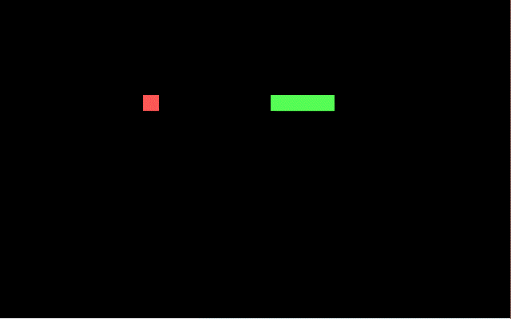

# x86 Snake OS

SnakeOS is a minimal real-mode kernel built for x86 16-bit architecture. It can be loaded onto a floppy (or a VM) and it just plays the Snake game.

Complete with ultra retro features like a 320x300 VGA display, intterupt 10h teletype text, a 16KiB stack, and a bootloader with less than 50 lines of assembly code!

## Compilation
Compile with GCC into a .vfd file:
```
make compile
```
Compile and run with virtualbox:
```
make run
```

## Usage
Play with the WASD keys.



## To do
* Integer printing
* Storage IO
* Dynamic memory allocation
* Menu
